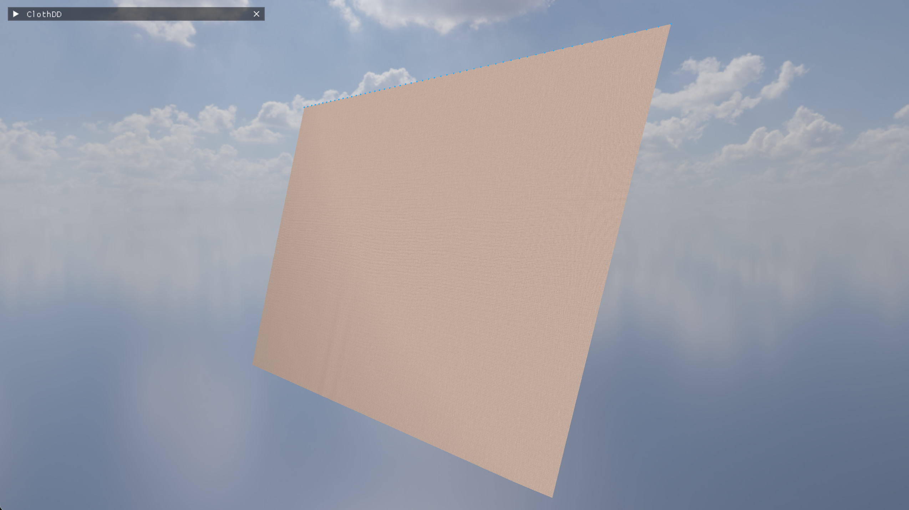

<p align="center">
  
</p>

<h1 align="center">ClothDD</h1>

<p align="center">
  <strong>Real-time cloth simulation with XPBD, domain-decomposed constraint solving, and GPU compute</strong>
</p>

<p align="center">
  <a href="#features">Features</a> &nbsp;·&nbsp;
  <a href="#demo">Demo</a> &nbsp;·&nbsp;
  <a href="#getting-started">Getting Started</a> &nbsp;·&nbsp;
  <a href="#controls">Controls</a> &nbsp;·&nbsp;
  <a href="#presets">Presets</a> &nbsp;·&nbsp;
  <a href="#architecture">Architecture</a> &nbsp;·&nbsp;
  <a href="#project-structure">Project Structure</a> &nbsp;·&nbsp;
  <a href="#license">License</a>
</p>

<p align="center">
  
  
  
  
  
</p>

---

## Features

- **XPBD solver** — Extended Position-Based Dynamics with per-type compliance (structural, shear, bend). Timestep-independent behaviour regardless of iteration count or substep count
- **GPU compute acceleration** — OpenGL 4.3 compute shaders with graph-coloring constraint dispatch (12 independent color groups, direct position writes, no atomics needed for constraints)
- **CPU domain decomposition** — parallel constraint solving via persistent thread pool with strip or 2D grid partitioning
- **Three solver modes** — CPU sequential, CPU threaded (DD), GPU compute (DD + graph-coloring)
- **Five scene presets** — Baseline, Dense Showcase (120×88), Ball Drop with animated collider, Ultra Dense (240×176), and Extreme Dense (480×352, ~169K particles, ~1M springs)
- **Spring topology** — structural, shear (diagonal), and bend (skip-one) springs with rest lengths computed from initial geometry
- **Offset Geometric Contact** — floor and sphere colliders with 0.012 offset for tunneling prevention, restitution, and friction
- **HDRI sky dome** — tone-mapped OpenEXR environment background with mipmaps and anisotropic filtering
- **Diffuse cloth texture** — stb_image-loaded fabric texture mapped via per-vertex UVs
- **Visual effects** — checkerboard ground plane, wind particle visualization, 2x MSAA
- **Debug info panel** — timing breakdown (sim/render/other ms), active solver name, mesh stats, hardware info, XPBD compliance values
- **Free camera** — orbit (LMB), pan (Ctrl+LMB / MMB), zoom (scroll), WASD + Space/Shift movement
- **Full ImGui control panel** — simulation parameters, material compliance sliders (logarithmic), rendering toggles, domain visualisation

<br>

## Demo

<p align="center">
  <video src="https://github.com/user-attachments/assets/f1334406-6a4a-426a-ac50-c13572ce2886" width="720" autoplay loop muted playsinline>
    Your browser does not support the video tag.
  </video>
</p>

| Baseline | Dense Showcase | Ball Drop | Ultra Dense |
|:--------:|:--------------:|:---------:|:-----------:|
|  |  |  |  |

<br>

## Getting Started

### Prerequisites

| Dependency | Required | Notes |
|------------|----------|-------|
| **CMake** ≥ 3.16 | Yes | Build system |
| **GLFW 3** | Auto | Fetched via FetchContent if not found locally |
| **OpenGL 4.3** | Recommended | GPU compute shaders. Falls back to GL 2.1 compatibility if GLAD unavailable |
| **GLAD** | Optional | GL function loading for compute shaders (`vcpkg install glad`) |
| **OpenEXR** + **Imath** | Optional | HDRI sky background (`vcpkg install openexr`) |

### Build

```bash
git clone https://github.com/colingalbraith/ClothDD.git
cd ClothDD

# With vcpkg (recommended — enables GPU compute + HDRI):
cmake -S . -B build -DCMAKE_BUILD_TYPE=Release -DCMAKE_TOOLCHAIN_FILE=/path/to/vcpkg/scripts/buildsystems/vcpkg.cmake
cmake --build build --config Release

# Without vcpkg (CPU-only, no HDRI):
cmake -S . -B build -DCMAKE_BUILD_TYPE=Release
cmake --build build --config Release
```

### Run

```bash
./build/clothdd          # Linux/macOS
./build/Release/clothdd  # Windows
```

> **HDRI background:** Place `kloofendal_48d_partly_cloudy_puresky_4k.exr` in the project root (available from [Poly Haven](https://polyhaven.com/a/kloofendal_48d_partly_cloudy_puresky)). Requires OpenEXR at build time.

<br>

## Controls

| Input | Action |
|-------|--------|
| **LMB drag** | Orbit camera |
| **Ctrl+LMB** / **MMB drag** | Pan camera |
| **WASD** | Move camera (forward/back/strafe) |
| **Space / Shift** | Camera up / down |
| **Q / E** | Camera up / down (alternate) |
| **Scroll** | Zoom in / out |
| **TAB** | Toggle UI panel |
| **Caps Lock / P** | Pause / resume |
| **.** | Single-step simulation |
| **G** | Drop cloth (unpin all) |
| **R** | Reset current scene |
| **1 – 5** | Load preset |
| **Esc** | Quit |

<br>

## Presets

| # | Preset | Grid | Particles | Springs | Substeps | Iterations | Notes |
|---|--------|------|-----------|---------|----------|------------|-------|
| 1 | **Baseline** | 56 × 40 | 2,240 | ~13K | 5 | 8 | Fast iteration; wireframe + domains on |
| 2 | **Dense Showcase** | 120 × 88 | 10,560 | ~63K | 5 | 10 | High-detail drape with strong wind |
| 3 | **Ball Drop** | 80 × 80 | 6,400 | ~38K | 5 | 16 | Animated sphere collider, no wind |
| 4 | **Ultra Dense** | 240 × 176 | 42,240 | ~250K | 6 | 14 | Stress test; wireframe off |
| 5 | **Extreme Dense** | 480 × 352 | 168,960 | ~1M | 6 | 16 | GPU compute showcase |

<br>

## Architecture

### Solver Modes

**CPU Sequential** — All springs solved one-by-one on the main thread in Gauss-Seidel order.

**DD + CPU Threaded** — Springs partitioned into spatial domains (strips or 2D grid). Domain-local springs solved in parallel via thread pool. Interface springs sequential. Final iteration always sequential for convergence matching.

**DD + GPU Compute** — Entire simulation runs on OpenGL 4.3 compute shaders. Springs partitioned into 12 color groups via graph coloring (2 colors per spring type). Each color group is fully parallel with direct position writes — no atomics needed for constraints. Gauss-Seidel-quality convergence at GPU speed.

### Simulation Pipeline

```
  Verlet integration (gravity + wind)
           │
           ▼
  ┌─────────────────────────────────┐
  │  XPBD Constraint Solve (N iter) │
  │  ┌───────────────────────────┐  │
  │  │  CPU: Domain 0..N springs │  │
  │  │       Interface springs   │  │
  │  │  GPU: Color 0..11 groups  │  │
  │  └───────────────────────────┘  │
  │  Floor / sphere collision (OGC) │
  │  Pin enforcement                │
  └─────────────────────────────────┘
           │
           ▼
     Recompute normals
```

### XPBD Compliance

Unlike traditional PBD stiffness (dimensionless 0–1 knob that depends on iteration count), XPBD uses physically-based **compliance** (inverse stiffness, units: m/N):

| Parameter | Default | Effect |
|-----------|---------|--------|
| Structural | 1e-7 | Nearly inextensible fabric |
| Shear | 1e-5 | Moderate diagonal resistance |
| Bend | 1e-3 | Soft draping folds |

Lower compliance = stiffer. Same compliance produces the same physical behaviour regardless of iteration count or substep count.

### Domain Decomposition

Two CPU partitioning strategies:

- **Strip layout** (default) — vertical strips by x-coordinate. Simple, cache-friendly.
- **Square layout** — approximate 2D grid based on cloth aspect ratio. Better for square cloths.

GPU uses **graph coloring** instead: 12 independent color groups where no two springs in the same group share a vertex.

<br>

## Project Structure

```
ClothDD/
├── CMakeLists.txt                  # Build config (GLFW, GLAD, OpenEXR)
├── LICENSE                         # MIT License
├── README.md
├── assets/                         # Screenshots, banner
│
├── src/
│   ├── main.cpp                    # Entry point, GL 4.3 context, main loop
│   ├── app.hpp / app.cpp           # AppState, presets, simulation stepping
│   ├── cloth.hpp / cloth.cpp       # XPBD solver, springs, Verlet, DD
│   ├── gpu_solver.hpp / .cpp       # GPU compute solver (graph-coloring)
│   ├── thread_pool.hpp             # Persistent thread pool (epoch-based)
│   ├── render.hpp / render.cpp     # OpenGL rendering, checkerboard, wind particles
│   ├── ui.hpp / ui.cpp             # ImGui panel, debug info, input callbacks
│   ├── hdri.hpp / hdri.cpp         # OpenEXR HDRI loader with Reinhard tone mapping
│   └── texture.hpp / texture.cpp   # stb_image texture loader with mipmaps
│
└── third_party/
    ├── stb_image.h                 # Single-header image loader
    └── imgui/                      # Vendored Dear ImGui (+ GLFW / OpenGL2 backends)
```

<br>

## Building Without Optional Dependencies

| Missing | Effect |
|---------|--------|
| GLAD | GPU compute disabled; falls back to CPU solver with GL 2.1 rendering |
| OpenEXR | HDRI sky dome disabled; solid-colour background |
| Both | Full simulation works, CPU-only, no HDRI |

<br>

## Contributing

Contributions are welcome! Please open an issue or pull request on [GitHub](https://github.com/colingalbraith/ClothDD).

1. Fork the repository
2. Create a feature branch (`git checkout -b feature/my-feature`)
3. Commit your changes
4. Push to the branch
5. Open a pull request

<br>

## License

This project is licensed under the [MIT License](LICENSE).

---

<p align="center">
  Made by <a href="https://github.com/colingalbraith">Colin Galbraith</a>
</p>
