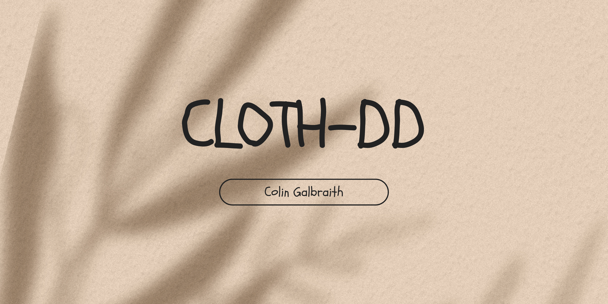
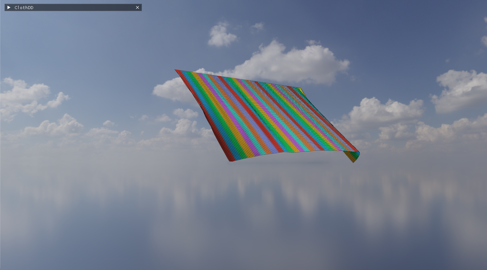
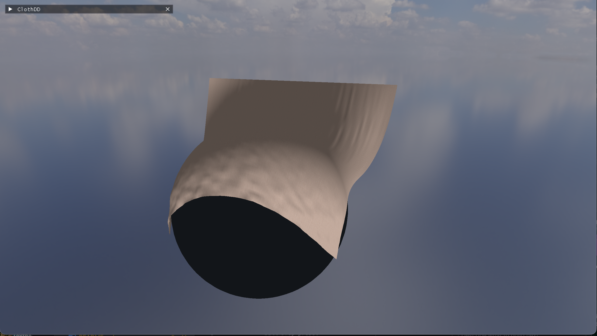
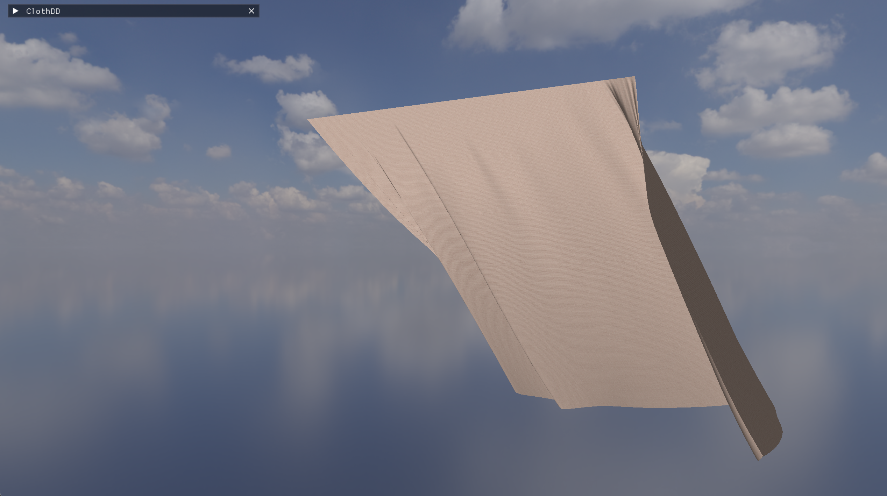

<p align="center">
  
</p>

<h1 align="center">ClothDD</h1>

<p align="center">
  <strong>Real-time cloth simulation with domain-decomposed constraint solving</strong>
</p>

<p align="center">
  <a href="#features">Features</a> &nbsp;·&nbsp;
  <a href="#demo">Demo</a> &nbsp;·&nbsp;
  <a href="#getting-started">Getting Started</a> &nbsp;·&nbsp;
  <a href="#controls">Controls</a> &nbsp;·&nbsp;
  <a href="#presets">Presets</a> &nbsp;·&nbsp;
  <a href="#architecture">Architecture</a> &nbsp;·&nbsp;
  <a href="#project-structure">Project Structure</a> &nbsp;·&nbsp;
  <a href="#license">License</a>
</p>

<p align="center">
  
  
  
  
</p>

---

## Features

- **Verlet integration** mass-spring cloth with configurable stiffness and damping
- **Domain decomposition** — partition the constraint solve into strip or 2D grid domains for locality-aware solving
- **Four scene presets** — Baseline, Dense Showcase (120×88), Ball Drop with animated collider, and Ultra Dense (240×176)
- **HDRI sky dome** — tone-mapped OpenEXR environment background with mipmaps and anisotropic filtering
- **Diffuse cloth texture** — stb_image-loaded fabric texture mapped via per-vertex UVs
- **Sphere and floor collision** with restitution and friction
- **Free camera** — orbit (LMB), pan (Ctrl+LMB / MMB), zoom (scroll), WASD/QE movement
- **Auto-scaling FPS graph** — normalised to the actual min/max range so small fluctuations are visible
- **Full ImGui control panel** — simulation parameters, rendering toggles, domain visualisation, colour pickers

<br>

## Demo

<p align="center">
  <video src="demovid.mp4" width="720" autoplay loop muted playsinline>
    Your browser does not support the video tag.
  </video>
</p>

| Baseline | Dense Showcase | Ball Drop | Ultra Dense |
|:--------:|:--------------:|:---------:|:-----------:|
|  |  |  |  |

<br>

## Getting Started

### Prerequisites

| Dependency | Required | Notes |
|------------|----------|-------|
| **CMake** ≥ 3.16 | Yes | Build system |
| **GLFW 3** | Yes | Windowing and input (`brew install glfw` / `apt install libglfw3-dev`) |
| **OpenGL 2.1** | Yes | Provided by the OS / GPU driver |
| **OpenEXR** + **Imath** | Optional | HDRI sky background (`brew install openexr imath`) |

### Build

```bash
git clone https://github.com/colingalbraith/DomainDecomp.git
cd DomainDecomp
cmake -S . -B build -DCMAKE_BUILD_TYPE=Release
cmake --build build -j$(nproc)
```

### Run

```bash
./build/clothdd
```

> **HDRI background:** Place a `.exr` file in the project root and set the path in the UI panel (default: `kloofendal_48d_partly_cloudy_puresky_4k.exr`). HDRI loading requires OpenEXR at build time.

<br>

## Controls

| Input | Action |
|-------|--------|
| **LMB drag** | Orbit camera |
| **Ctrl+LMB** / **MMB drag** | Pan camera |
| **WASD** | Move camera target |
| **Q / E** | Camera up / down |
| **Scroll** | Zoom in / out |
| **TAB** | Toggle UI panel |
| **Space** | Pause / resume |
| **.** | Single-step simulation |
| **1 – 4** | Load preset (Baseline, Dense, Ball Drop, Ultra Dense) |
| **Esc** | Quit |

<br>

## Presets

| Preset | Grid | Substeps | Domains | Wind | Notes |
|--------|------|----------|---------|------|-------|
| **Baseline** | 56 × 40 | 5 | 12 strips | 2.5 | Fast iteration; wireframe + domains on |
| **Dense Showcase** | 120 × 88 | 5 | 28 strips | 8.5 | High-detail drape with strong wind |
| **Ball Drop** | 80 × 80 | 5 | 16 strips | 0 | Animated sphere collider, no wind |
| **Ultra Dense** | 240 × 176 | 6 | 48 squares | 10.0 | Stress test; wireframe off |

<br>

## Architecture

### Simulation Pipeline

```
  Verlet integration (gravity + wind)
           │
           ▼
  ┌────────────────────────────┐
  │  Constraint Solve (N iter) │
  │  ┌──────────────────────┐  │
  │  │  Domain 0 springs    │  │
  │  │  Domain 1 springs    │  │
  │  │  …                   │  │
  │  │  Interface springs   │  │
  │  └──────────────────────┘  │
  │  Floor / sphere collision  │
  │  Pin enforcement           │
  └────────────────────────────┘
           │
           ▼
     Recompute normals
```

### Domain Decomposition

Two partitioning strategies are available:

- **Strip layout** (default) — vertical strips by x-coordinate. Simple, cache-friendly for horizontally pinned cloths.
- **Square layout** — approximate 2D grid based on the cloth aspect ratio. Better locality for square cloths or very high domain counts.

Springs whose endpoints fall in the same domain are solved in the domain pass. Springs crossing domain boundaries ("interface springs") are solved in a separate pass after all domains, ensuring coupling.

When domain decomposition is turned off, all springs are solved in a single pass.

<br>

## Project Structure

```
ClothDD/
├── CMakeLists.txt                  # Build configuration
├── LICENSE                         # MIT License
├── README.md
├── docs/                           # Screenshots, banner, video thumbnail
│
├── src/
│   ├── main.cpp                    # Entry point, GLFW window, main loop
│   ├── app.hpp / app.cpp           # AppState, presets, simulation stepping
│   ├── cloth.hpp / cloth.cpp       # Grid generation, springs, Verlet, domain decomposition
│   ├── render.hpp / render.cpp     # OpenGL 2.1 rendering (sky, cloth, overlays)
│   ├── ui.hpp / ui.cpp             # ImGui control panel and input callbacks
│   ├── hdri.hpp / hdri.cpp         # OpenEXR HDRI loader with Reinhard tone mapping
│   └── texture.hpp / texture.cpp   # stb_image texture loader with mipmaps
│
└── third_party/
    ├── stb_image.h                 # Single-header image loader
    └── imgui/                      # Vendored Dear ImGui (+ GLFW / OpenGL2 backends)
```

<br>

## Building Without OpenEXR

If OpenEXR is not installed, the HDRI sky dome is disabled at compile time and the simulation runs with a solid-colour background. All other features work normally.

```bash
cmake -S . -B build       # OpenEXR is detected automatically
cmake --build build
```

<br>

## Contributing

Contributions are welcome! Please open an issue or pull request on [GitHub](https://github.com/colingalbraith/DomainDecomp).

1. Fork the repository
2. Create a feature branch (`git checkout -b feature/my-feature`)
3. Commit your changes (`git commit -m 'Add my feature'`)
4. Push to the branch (`git push origin feature/my-feature`)
5. Open a pull request

<br>

## License

This project is licensed under the [MIT License](LICENSE).

---

<p align="center">
  Made by <a href="https://github.com/colingalbraith">Colin Galbraith</a>
</p>
